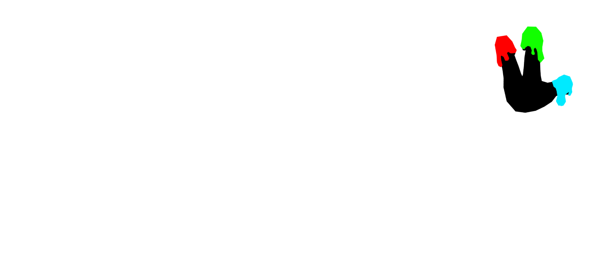
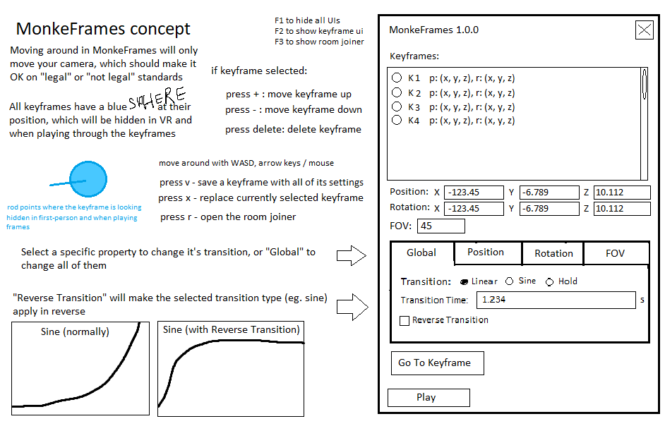

<h1 id="readme">
   
  
  
</h1>

MonkeFrames is a keyframe-based camera animator loosely based on the Orion Drift spectator view that allows you to plan out camera movements with transitions for each property.

Create a keyframe by pressing V. It's properties will show up on the MonkeFrames panel in the top right. You can tweak its transitions, position, and rotation, or replace the currently selected keyframe by pressing X.

## Installation
### MonkeModManager
You can install MonkeFrames with [MonkeModManager](https://git.sirkingbinx.dev/sirkingbinx/MonkeModManager/-/releases).
1. Search for "MonkeFrames" on the Search bar
2. Check the box next to "MonkeFrames"
3. Press "Install / Update"

### Manual
1. Download `MonkeFrames.zip` from the [releases](https://git.sirkingbinx.dev/monkeframes/editor/-/releases) page
2. Extract the zip file into `BepInEx/plugins/` (BepInEx) or `Mods` (MelonLoader)

## Usage
Press `V` to create a new keyframe. You can press `T` to create a new keyframe looking at the monke, `X` to replace the current keyframe with a new one, or click `Keyframe` > `Delete Keyframe` on the topbar to delete the selected keyframe.

Once a keyframe is created, you can see it's values with the Keyframe Editor. Press `View` > `Keyframe Editor` to view and select every keyframe in your project.

Once you are done with editing, you can compile your project (turn those keyframes into movement) with `Project` > `Compile`, then press `Project > Compile & Play`. Press Space to exit the player and return to MonkeFrames.

You can save your project with `Project > Save Project`, then reopen it by selecting `Project > Load Project` and choosing your project. All projects are saved in a special folder you can access by pressing `Win` + `R`, and then entering `%USERFOLDER%/AppData/LocalLow/Another Axiom/Gorilla Tag/MonkeFrames/projects`.

## For Developers
### Issue Trackers
All issue tracking (including bug reporting, feature requests, or any other MonkeFrames inquiries) happens on the [Discord](https://discord.gg/monkeframes). Use the `#issues` forum channel and select any tags that apply.

### Contribution
- **MonkeFrames.Editor** is freely avaliable for pull requests.
- **MonkeFrames.Compiler** is avaliable for pull requests but is much less open to change. We accept optimization tweaks, code cleanup, but not much in terms of functionality change.

### Embed MonkeFrames into your project
You can embed the keyframe functionality of MonkeFrames into your own projects. See [MonkeFrames.Compiler](https://git.sirkingbinx.dev/monkeframes/compiler).

## Credits
- [sirkingbinx (bingus)](https://git.sirkingbinx.dev/sirkingbinx): Developer, documentation, concept art
- [uhJames](https://www.youtube.com/@uhJamesvr): Design, logos, art, commissioner

## Extras

